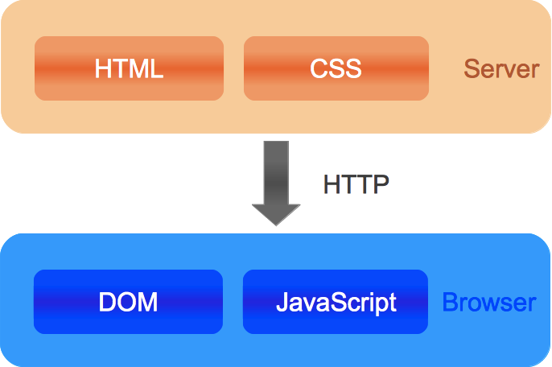
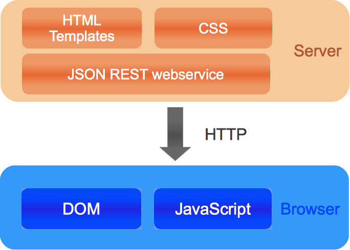

# Frontend JavaScript

<h2 class="frontpage">David Luecke</h2>

GitHub:
<a class="frontpage" href="http://daffl.github.com">daffl.github.com</a>

Twitter:
<a class="frontpage" href="http://twitter.com/daffl">@daffl</a>

---

# JavaScript in the browser

---

# JavaScript libraries

---

## Purpose

## Make using the language and manipulating the DOM easier
## And/or provide client side UI controls

* [Prototype](http://www.prototypejs.org/) - Part of the AJAX support for Ruby on Rails
* [Mootools](http://mootools.net/) - Lighweight OO framework for JavaScript
* [YUI](http://developer.yahoo.com/yui/) - JavaScript and CSS framework wit UI controls and build tools
* [Dojo Toolkit](http://dojotoolkit.org/) - Toolkit for rapid JavaScript application development,
	packaging and widget system (Dijit)
* [ExtJS](http://www.sencha.com/products/extjs/) - UI heavy framework for rich internet applications
* [jQuery](http://jquery.com/) - Library to simplify DOM interaction, effects and AJAX interaction

---

## ExtJS

* Originally an add-on library extension of YUI
* Optional interoperability with Prototype and jQuery
* Big selection of pre packaged UI controls
	* Grids, Charts, Tabs, Trees
	* Window manager
	* Form elements, combobox
* GPL for open source projects (commercial otherwise)
* MVC parts in version 4.0
* ~ 500Kb
* [Web Desktop demo](http://dev.sencha.com/deploy/ext-4.1.0-gpl/examples/desktop/desktop.html)

---

## jQuery

* Simplifies DOM manipulation and traversal and event handling
* AJAX support
* Effects
* UI elements with [jQuery UI](http://jqueryui.com) (~200Kb)
* Eliminates cross browser differences
* Plugin mechanism
* Fully open source (MIT licensed)
* ~ 32Kb

---

## jQuery - Example

__jQuery__

	!javascript
	$(document).ready(function() {
		$('button').click(function() {
			var name = $('[name="your-name"]').val();
			$('#mydiv').html('Hi ' + name);
		});
	});

__Markup__

	!html
	<input type="text" name="your-name" />
	<button>Say Hi</button>
	

---

# Application Organization

---

## Scope in JavaScript

__JavaScript only knows function scope__

	!javascript
	for(var i = 0; i < 10; i++) {
		var x = 'testing';

		(function(arg) {
			var y = 42;
		})(i);
	}

__Global variables__

	!javascript
	function test() {
		var local = 42;
		global = 'global';
	}

	test();

---

## Namespacing

	!javascript
	var App = {
		init : function() {
			/* ... */
		},
		Dummy : {
			sayHi : function(name) {
				return 'Hi ' + name;
			}
		}
	}

	App.Blog = {
        getPosts : function() { /* ... */ }
    }

	console.log(App.Dummy.sayHi('David'));

---

## Modules

	!javascript
	var APP = (function() {
		// Do stuff
		var privateVariable = 'Hello ',
			sayHi = function(name) {
				return privateVariable + name;
			};
		// Return API
		return {
			init : function() { /* ... */ },
			hi : sayHi
		}
	})();

	console.log(APP.sayHi('David'));

---

## A jQuery plugin

	!javascript
	(function($) {
		$.fn.myPlugin = function(name) {
			var self = $(this),
				span = $(''),
				button = $('<button>Say Hi</button>');

			button.click(function() {
				self.find('span').html('Hi ' + name);
			});

			self.append(span).append(button);
			return this;
		}
	})(jQuery);

	// 

	$('#mydiv').myPlugin('David');

---

## __A__synchronous __m__odule __d__efinition

__AMD__: [CommonJS](http://www.commonjs.org/) specification for
[asynchronously loading dependencies](https://github.com/amdjs/amdjs-api/wiki/AMD).

	!javascript
	// say_hi.js
	define(function() {
		var privateVariable = 'Hello ';
		return {
			sayHi : function(name) {
                return privateVariable + name;
            }
		}
	});

	// module.js
	define(['say_hi.js'], function(hisayer) {
		return {
			result : hisayer.sayHi('David'),
			sayHi : hisayer
		}
	});

	// app.js
	var module = require('module.js', function(module) {
		module.sayHi('You'); // Hello You
		module.result; // -> Hello David
	});

---

## Environments

__Development__:

* Functionality split into files
* Unmodified source code available for debugging

__Production__:

* Minimize HTTP requests
* Leverage caching
* Minimize file size

---

## Tools

* [JSMin](http://www.crockford.com/javascript/jsmin.html) - JavaScript minifier by
[Douglas Crockford](http://www.crockford.com/)
* [YUI compressor](http://developer.yahoo.com/yui/compressor/) - CSS and JavaScript minifier
* [Google Closure compiler]() - JavaScript minifier
* [StealJS](http://javascriptmvc.com/docs.html#!stealjs) - JavaScript and dynamic asset loader and build environment
* [RequireJS](http://requirejs.org/) - JavaScript file and module loader (AMD)

---

# Communication

---

## __J__ava__S__cript __O__bject __N__otation

__JSON__: A text based data exchange format

* Subset of JavaScript
* Supported types
	* Primitives (String, Number, Boolean, *null*)
	* Arrays
	* Objects

__Example__

	!javascript
	{
		"username" : "User 1",
		"emails" : ["user@example.com", "other@mail.com"]
		"address" : {
			"street" : "Example street",
			"city" : "Calgary"
		},
		"age" : 42
	}

---

## __A__synchronous __Ja__vaScript and __X__ML

__AJAX__: Issue HTTP requests outside of the normal browser request/response cycle using JavaScript.

	!javascript
	$('#content').load('ajax/test.html', function() {
		alert('Content loaded.');
	});

__Loading JSON__

	!javascript
	$.ajax({
		url: 'http://example.com/user.json',
		dataType: 'json',
        success: function(data) {
            alert(data.username);
        }
    });

---

## __Re__presentational __S__tate __T__ransfer

__REST__: A resource oriented software architecture style for distributed systems

__URI__: A unique identifier for a resource (e.g. http://example.com/user/1, tel:911)

* Client-Server
* Stateless
* Caching
* Well defined operations
* Layered architecture

In HTTP:

* __GET__ - Request a representation of a resource
* __POST__ - Update a resource
* __PUT__ - Create a new resource
* __DELETE__ - Delete a resource
* __HEAD__ - Like GET but without payload

---

## REST - PUT

__Request__

	PUT /users HTTP/1.1
	Host: example.com
	Content-Type: text/xml
	Content-Length: 77
	Accept: application/xml,application/json
	Accept-Charset: ISO-8859-1,utf-8

	<user>
	        <username>UserX</username>
	        <password>supersecret</password>
	</user>

__Response__

	HTTP/1.1 201 Created
	Date: Fri, 26 Feb 2010 11:39:07 GMT
	Server: Awesome NodeJS server
	Content-Location: http://example.com/users/2

---

## REST- GET

__Request__

	GET /users/2 HTTP/1.1
	Host: example.com
	Accept: application/json
	Accept-Charset: utf-8,ISO-8859-1

__Response__

	HTTP/1.1 200 OK
    Date: Fri, 26 Feb 2010 13:14:07 GMT
    Server: Awesome NodeJS server
    Content-Type: application/json; charset=utf-8
    Content-Length: 55

    {
        "username" : "UserX",
        "password" : "supersecret"
    }

---

# Single page applications

---

## A different way to interact

---

## BackboneJS

A client side MVC style framework to structure JavaScript applications.

	!javascript
	var Photo = Backbone.Model.extend({

	    // Default attributes for the photo
	    defaults: {
	      // Ensure that each photo created has an `src`.
	      src: "placeholder.jpg",
	      caption: "A default image",
	      viewed: false
	    },

	    initialize: function() {
	    }

	});

---

## BackboneJS - Photo gallery

	!javascript
	var PhotoGallery = Backbone.Collection.extend({

        // Reference to this collection's model.
        model: Photo,

        // Filter down the list of all photos that have been viewed
        viewed: function() {
          return this.filter(function(photo){ return photo.get('viewed'); });
        },

        // Filter down the list to only photos that have not yet been viewed
        unviewed: function() {
          return this.without.apply(this, this.viewed());
        }

    });

---

## CanJS

Client side MVC framework for building rich web applications. Supports *jQuery*, *Zepto*, *Mootools*,
*Dojo*, *YUI*.

* __can.Construct__ - inheritable constructor functions
* __can.Observe__ - observable objects
* __can.Model__ - observes connected to a RESTful JSON interface
* __can.view__ - template loading, caching, rendering
* __can.EJS__ - live binding templates
* __can.Control__ - declarative event bindings
* __can.route__ - back button and bookmarking support

---

## CanJS - Example

__A view__

	!html
	

__Controls and Models__

	!javascript
	var Todo = can.Model({
	  findAll : 'GET /todos',
	  findOne : 'GET /todos/{id}',
	  create  : 'POST /todos',
	  update  : 'PUT /todos/{id}',
	  destroy : 'DELETE /todos/{id}'
	}, {});

	var Control = can.Control({
		'button click' : function() {
			document.findElementById('mydiv').innerHtml =
        		can.view('todos', Todo.findAll());
		}
	});

---

# Mobile

[Phonegap](http://phonegap.com/): A cross platform (iOS, Android, Blackberry, WebOS, Symbian) framework
to run single page applications providing access to mobile phone functionality.

	!javascript
	navigator.camera.getPicture(function(imageData) {
		var image = document.getElementById('myImage');
		image.src = "data:image/jpeg;base64," + imageData;
	}, null, {
		quality: 50,
        destinationType: Camera.DestinationType.DATA_URL
    });

__Mobile development frameworks__

* [SenchaTouch](http://www.sencha.com/products/touch)
* [jQuery Mobile](http://jquerymobile.com/)
* [Dojo mobile](http://dojotoolkit.org/features/mobile)

---

# Testing

---

## Client side testing

Client side testing is still not a common practise

__Unit tests__

Test if separate contained parts (e.g. a module) return expected values,
injecting mock dependencies if necessary.

__Functional tests__

Test if user interaction works as expected

---

## Jasmine

A behaviour driven development (BDD) framework to test JavaScript code:

	!javascript
	function sayHi(name) {
		return 'Hi ' + name;
	}

	function getAnswer() {
		return 42;
	}

	describe('A test suite', function () {
		it('Should say hi to David', function() {
			expect(sayHi('David')).toBe('Hi David');
		});

		it('Should return the answer to all questions, function() {
			expecte(getAnswer()).toBe(42);
		}
    });

---

## QUnit

Originally part of jQuery but evolved into a separate unit testing suite:

	!javascript
	module('Hi Sayer');

	test('Saying hi', function() {
		var actual = sayHi('David');
		equals(actual, 'Hi David', 'Said Hi');
	});

	test('Returns the answer to all questions', function() {
		equals(answer(), 42, 'Got the answer to all questions');
	});

---

## FuncUnit

A functional testing suite to simulate user input based on QUnit and jQuery:

	!javascript
	module("jQuery Demo tester",{
		setup: function() {
			S.open('demo.html')
		}
	});

	test("Plugin says hi",function(){
		// Type some text into <input name="your-name" />
		S('input[name="your-name"]').click().type("David")
		// Click the button
		S('button').click();
		// Check the HTML content
		S('#mydiv').html('Hi David');
    });

---

# Documentation

	!javascript
	/**
	 * A Person class.
	 * @param name The name of the person
	 */
	var Person = function(name) {
		this.name = name;
	}

	/**
	 * Says hi.
	 * @return {String} A string saying hi
	 */
	Person.prototype.sayHi = function() {
		return 'Hi ' + this.name;
	}

---

## DocumentJS

Documentation generator for JSDoc style comments:

	!javascript
	/*
     * @page index CRM
     * @tag home
     *
     * ## Little CRM
     *
     * Our little CRM only has two classes:
     *
     * * Customer
     * * Order
     */

	/**
	 * @parent index
	 * A function that says hi
	 * @param {String} name The name to say hi to
	 * @return {String} The saying hi string
	 */
	function sayHi(name) {
		return 'Hi ' + name;
	}

---

## Docco

A quick-and-dirty, hundred-line-long, literate-programming-style documentation generator.

Originally for Coffeescript but works with JavaScript as well.

	!javascript
	// # Saying hi
	// This is my litte program that says hi.

	// A function that says hi
	// name - The name to say hi to
	function sayHi(name) {
		return 'Hi ' + name;
	}

---

# Thank you
